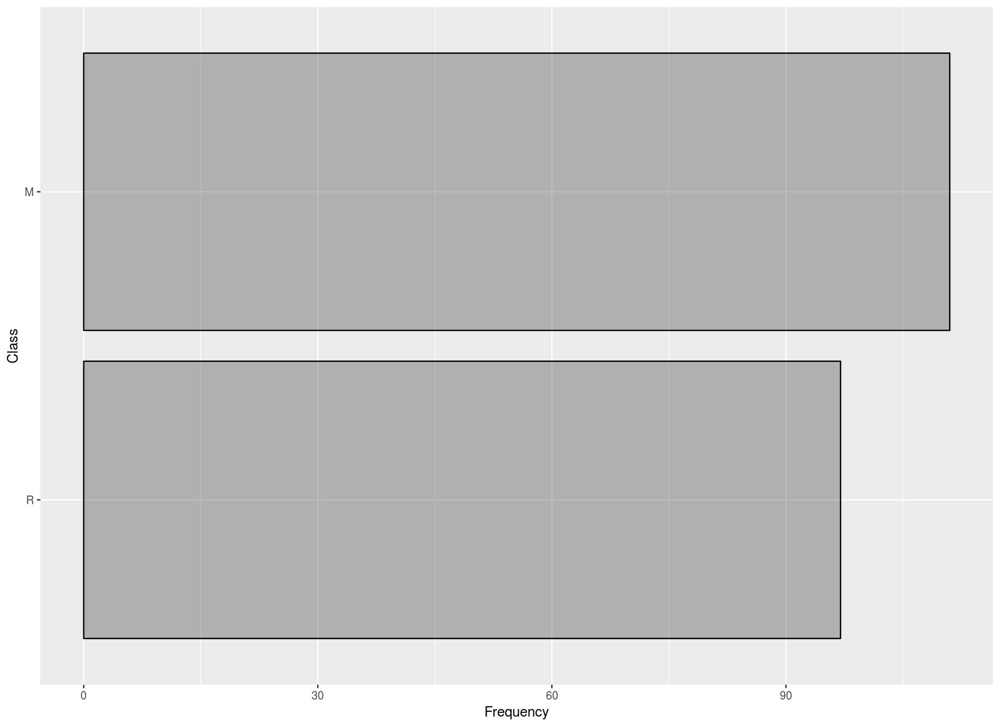
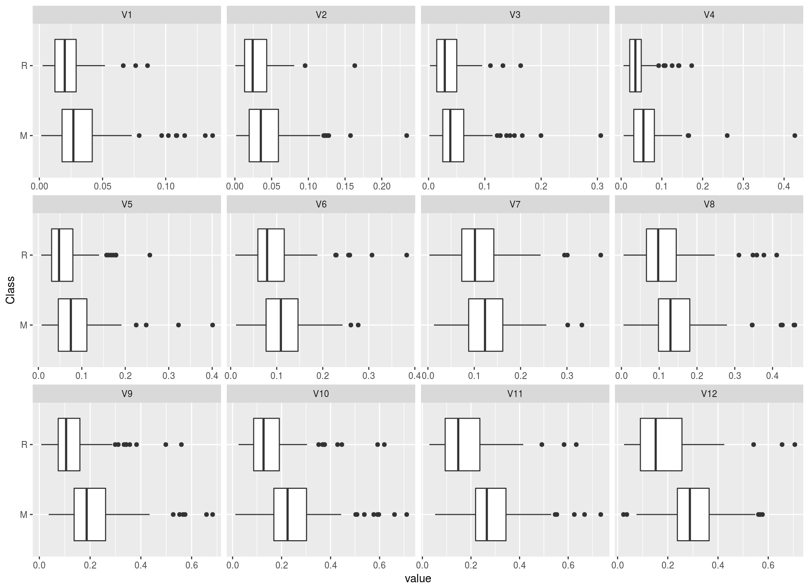
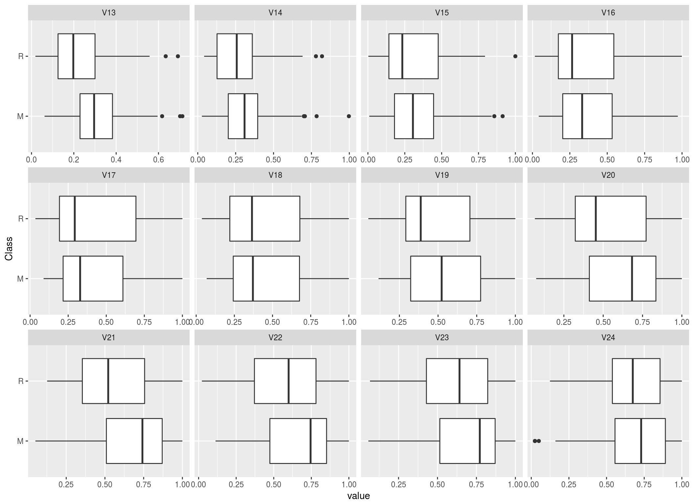
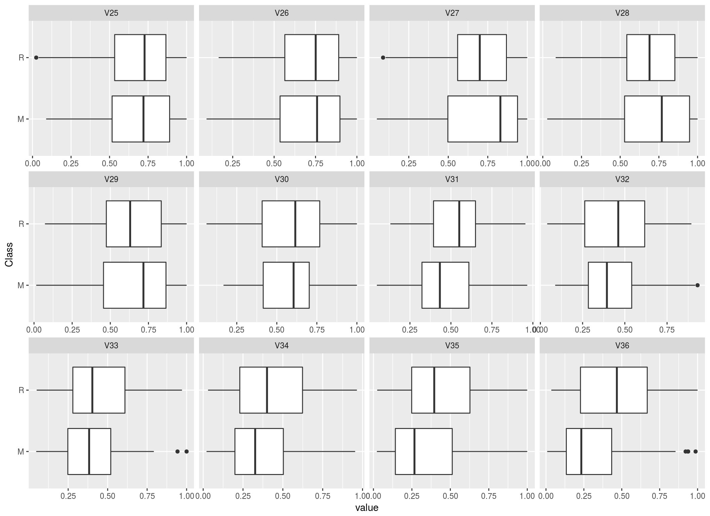
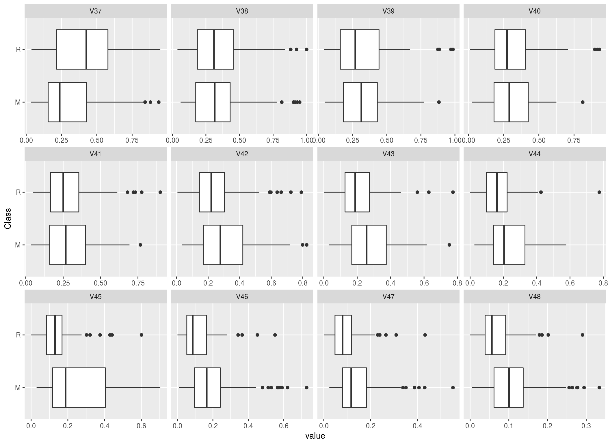
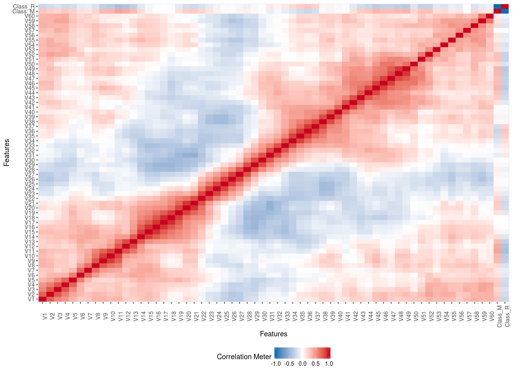
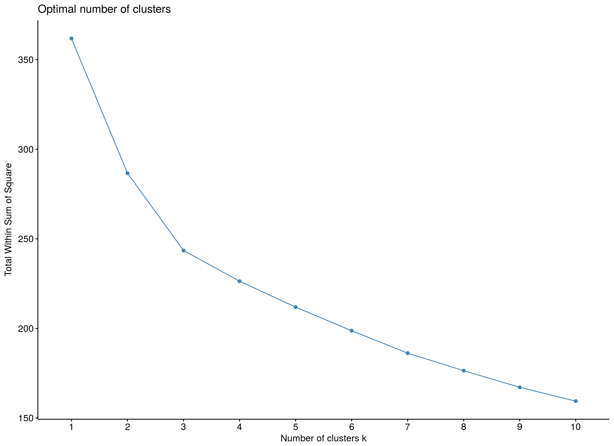

# Document Updated last:


```r
st.time.0 <- Sys.time()
st.time.0 
```

```
## [1] "2018-05-08 00:25:03 EDT"
```


```r
# Import Data data(Sonar) write.csv(Sonar, file = paste(DATA.DIR,
# 'sonar.csv', sep='') )
Sonar <- read.csv(file = paste(DATA.DIR, "sonar.csv", sep = "/"))
Sonar <- select(Sonar, -X)

# reomve rows with missing values Sonar_completeCase =
# Sonar[complete.cases(Sonar),] Sonar =
# Sonar[sample(nrow(Sonar)),]

# Assign Predictors and Response
y = Sonar$Class
X = Sonar[, -61]
```

# Exploratory Data Analysis

## Initial Visualization

Without knowing anything about the data, my first 3 tasks are almost always:

* Are there missing values, and what is the missing data profile?   
* How does the categorical frequency for each discrete variable look like?  
* What is the distribution of each continuous variable?


The plot of missing data is not displayed because there is no missing data.  


### Categorical Frequency





### Continuous Distribution

Univariate histograms. The x-variables are not normally distributed..


Boxplots by Class label. Check for obviously different distribution of x-variables, by each class of Y.  



## Data Overview


```
## autoEDA | Setting color theme 
## autoEDA | Removing constant features 
## autoEDA | 0 constant features removed 
## autoEDA | Removing zero spread features 
## autoEDA | 0 zero spread features removed 
## autoEDA | Removing features containing majority missing values 
## autoEDA | 0 majority missing features removed 
## autoEDA | Cleaning data 
## autoEDA | Correcting sparse categorical feature levels 
## autoEDA | Sorting features 
## autoEDA | Binary classification outcome detected 
## autoEDA | Calculating feature predictive power 
## autoEDA | Visualizing data
```



## Bivariate Freqploy

There is significant overlap from the Rock/Mine signal on many of the predictor variables. It appears to be challenging to find strong predictors from a large portion of the variables. 


### Maximal Information Coefficient

A new statistic called the "Maximal Information Coefficient" (MIC) is able to describe the correlation between paired variables regardless of linear or nonlinear relationship. 


### Correlation 


### Hierarchial Clustering




# Machine Learning

The machine learning package H2O is leveraged using the R interface. 

## Embed machine learning file into main file. 


```r
## Read R Script source('deep_learn_h2o.R') source(file =
## paste(CODE.DIR, 'deep_learn_h2o.R', sep='/') )
```


## Child doc: Spin

The main file `grp_lasso.Rmd` imports a R script(s) and embeds into the main doc. The outputs can be messy or buggy but there are many benefits to logically distributing long files.

This child file `deep_learn_h20_roxy.R` uses roxygen formatting on a raw R file.


```r
# spin_child('/media/disc/Megasync/R/regularization/group_lasso/code/spinner_test.R')
{
    {
        knitr::spin_child("/media/disc/Megasync/R/regularization/group_lasso/code/deep_learn_h20_roxy.R")
    }
}
```


## LIBRARIES for running h2o  

```r
# Download packages that H2O depends on.
pkgs <- c("pROC", "RCurl", "jsonlite")
for (pkg in pkgs) {
    if (!(pkg %in% rownames(installed.packages()))) {
        install.packages(pkg)
    }
}
# Load libs
pkg.load <- c("AppliedPredictiveModeling", "bitops", "caret", "dplyr", 
    "ggbiplot", "h2o", "mlbench", "pROC", "RCurl", "rjson", "ROCR", 
    "statmod", "tools")
sapply(pkg.load, require, character.only = TRUE)
```

## Helper File for DeepLearning Model

```r
source("/media/disc/Megasync/R/regularization/group_lasso/code/helper_h2o.R")
```


## MAKE RESULTS REPEATABLE

```r
seed = 0
set.seed(seed)
```

INITIALIZE H2O --------------------------------------------------------------  

H2O is a Java application. It runs a web server and interacts with R
via REST-like web services. The command below starts the H2O. The nthreads
parameter value -1 tells H2O to run with as many threads as there are
CPU cores.
## h20 Config 

```r
h2o <- h2o.init(nthreads = -1, max_mem_size = "14g")
```

```
## 
## H2O is not running yet, starting it now...
## 
## Note:  In case of errors look at the following log files:
##     /tmp/RtmpiNHIu5/h2o_npcomplete_started_from_r.out
##     /tmp/RtmpiNHIu5/h2o_npcomplete_started_from_r.err
## 
## 
## Starting H2O JVM and connecting: ......................................... Connection successful!
## 
## R is connected to the H2O cluster: 
##     H2O cluster uptime:         41 seconds 605 milliseconds 
##     H2O cluster timezone:       America/New_York 
##     H2O data parsing timezone:  UTC 
##     H2O cluster version:        3.18.0.8 
##     H2O cluster version age:    18 days  
##     H2O cluster name:           H2O_started_from_R_npcomplete_xgj592 
##     H2O cluster total nodes:    1 
##     H2O cluster total memory:   12.44 GB 
##     H2O cluster total cores:    4 
##     H2O cluster allowed cores:  4 
##     H2O cluster healthy:        TRUE 
##     H2O Connection ip:          localhost 
##     H2O Connection port:        54321 
##     H2O Connection proxy:       NA 
##     H2O Internal Security:      FALSE 
##     H2O API Extensions:         XGBoost, Algos, AutoML, Core V3, Core V4 
##     R Version:                  R version 3.4.4 (2018-03-15)
```

LOAD SONAR DATA AND CREATE TRAINING AND TEST SETS ---------------------------


Load data into an H2O data frame

```r
# sonar.hex =
# h2o.importFile('/media/disc/Megasync/R/regularization/group_lasso/data/sonar_dl.csv')
sonar.hex <- h2o.importFile(path = pathToData, destination_frame = "sonar.hex")
```

```
## 
  |                                                                       
  |                                                                 |   0%
  |                                                                       
  |====                                                             |   6%
  |                                                                       
  |=================================================================| 100%
```

```r
# Convert the H2O data frame into an R data frame for later use.
sonar.df = as.data.frame(sonar.hex)
# sonar.df <- select(sonar.df, -C1)
```

Create the feature vectors by dropping the classifications

```r
classVariableIndex = 61
sonar.features = sonar.df[, -classVariableIndex]
# Rename the classification varible to something meaningful
names(sonar.df)[classVariableIndex] = "Class"
```

Use H2O to create the traning and test data sets from the original data.
Use 80% of the data for training and 20% for testing. Pass in the seed value
to make the results repeatable.

```r
sonar.split = h2o.splitFrame(data = sonar.hex, ratios = 0.8, seed = seed)
# Create named varaibles for the traning and test data
sonar.train = sonar.split[[1]]
sonar.test = sonar.split[[2]]
# Create R data frames from the H2O data frames
sonar.train.df = as.data.frame(sonar.train)
names(sonar.train.df)[classVariableIndex] = "Class"
sonar.test.df = as.data.frame(sonar.test)
names(sonar.test.df)[classVariableIndex] = "Class"
```

## TRELLIS PLOT   
 ----------------------------------------------------------------

Create a trellis plot using all 60 features. Notice that it is a useless mess.

```r
transparentTheme(trans = 0.5)
featurePlot <- featurePlot(x = sonar.features, y = sonar.df$Class, 
    plot = "pairs", pscales = FALSE, cex = 0.05, auto.key = list(columns = 2))
```

PRINCIPAL COMPONENT ANALYSIS OF DATA SET 
------------------------------------  

Generally, anything with more than 10 features is considered high dimensional data.
Text mining and genomic microarrays have thousands of dimensions and they are the
go-to examples of high dimensional data.
---

```r
# Use principal components to reduce the dimensionality of the features.
sonar.princomp = prcomp(sonar.features, #x.vars,  
                        center = TRUE,
                        scale = TRUE,
                        #tol=.3, #rank. = 15,
                        retx = TRUE)
sonar.princomp.7 = prcomp(sonar.features, #x.vars,  
                        center = TRUE,
                        scale = TRUE,
                        tol=.4, 
                        retx = TRUE)
```

Plot the first three principal components. Together, the first three
principle components accounts for almost 50% of the variance in the data!
That means they are very rich in information. After the PCA transformation,
The original data set contains 60 features. If we think of the first three principal
components as features, then 3 features can account for 50% of the information in the
original data set. That means the the first three principle components consume only
3/60, or just 5% of the space as the original data, but contains almost half the signal.
The upshot is that PCA is a kind of lossy data compression! 

## PCA Cumulative Variance

Look at cumulative proportion of the variance explained by the principle components:

```r
summary(sonar.princomp.7)
```

```
## Importance of first k=7 (out of 60) components:
##                           PC1    PC2    PC3     PC4     PC5     PC6
## Standard deviation     3.4940 3.3672 2.2649 1.84595 1.73328 1.56173
## Proportion of Variance 0.2035 0.1890 0.0855 0.05679 0.05007 0.04065
## Cumulative Proportion  0.2035 0.3924 0.4779 0.53473 0.58480 0.62545
##                            PC7
## Standard deviation     1.40264
## Proportion of Variance 0.03279
## Cumulative Proportion  0.65824
```

```r
# PCA TRELLIS PLOT ++++++++++++++++++++
transparentTheme(trans = 0.3)
numberOfPrincipalComponentsToPlot = 3
```

Plotting the principle components shows us that the rocks and mines have a lot of
overlap. The more overlaps, the harder it will be for the machine learning algorithm
to distinguish the difference between rocks and mines. However, it is easy to see the
two classes do not overlap entirely; there is definitely some signal for the algorithm
to lock onto.

```r
featurePlot(x = sonar.princomp$x[, 1:numberOfPrincipalComponentsToPlot], 
    y = sonar.df$Class, plot = "pairs", pscales = FALSE, auto.key = list(columns = 2))
```


### PLOT FIRST AND SECOND PRINCIPLE COMPONENTS ----------------------------------

Use a special libary to plot the first principle component against the second
principle component. Draw a ellipses around the observations. Observations
inside the ellipse are less than 1 std dev away from mean.

```r
g <- ggbiplot(
  sonar.princomp,
  groups = sonar.df$Class,
  var.axes = FALSE,
  #
  ellipse = TRUE
  )
g <- g + scale_color_discrete(name = '')
g <- g + theme(legend.direction = 'horizontal',
               legend.position = 'top')
print(g)
```


## MACHINE LEARNING EXPERIMENTS ------------------------------------------------

### Decision Tree  
Let's see how a decision tree does. Having a baseline to compare accuracy is useful. 

```r
decisionTree = train(Class ~ ., sonar.train.df, method = "ctree")
# Visually inspect the tree.
plot(decisionTree$finalModel)
```


Evaluate the decision tree performance

```r
decisionTree.predictions = predict(decisionTree, sonar.test.df[, -classVariableIndex])
confusionMatrix(decisionTree.predictions, sonar.test.df$Class)
```

```
## Confusion Matrix and Statistics
## 
##           Reference
## Prediction  M  R
##          M 15  2
##          R  5 13
##                                           
##                Accuracy : 0.8             
##                  95% CI : (0.6306, 0.9156)
##     No Information Rate : 0.5714          
##     P-Value [Acc > NIR] : 0.003999        
##                                           
##                   Kappa : 0.6016          
##  Mcnemar's Test P-Value : 0.449692        
##                                           
##             Sensitivity : 0.7500          
##             Specificity : 0.8667          
##          Pos Pred Value : 0.8824          
##          Neg Pred Value : 0.7222          
##              Prevalence : 0.5714          
##          Detection Rate : 0.4286          
##    Detection Prevalence : 0.4857          
##       Balanced Accuracy : 0.8083          
##                                           
##        'Positive' Class : M               
## 
```

## AUC results

The area-under-curve (AUC) results look good.

```r
decisionTree.predictions.probabilities = predict(decisionTree, sonar.test.df[, 
    -classVariableIndex], type = "prob")
decisionTree.roc = roc(sonar.test.df$Class, decisionTree.predictions.probabilities$M)
# Area under the curve: 0.8433
plot(decisionTree.roc)
```


Now we pull out the big guns and feed the problem to H2O's algorithms.

Review ROC plots. Explain it in terms of classifying rocks vs mines.
The more tolerant you are of "slop" (false positives), the more you can be sure
you aren't missing any true positives. The more willing you are to
accept the computer misclassifying, the less
likely you are to miss-classify a mine.

PS: ROC curve technical background requires some understanding. I've been meaning to read
these articles about it:
http://blogs.sas.com/content/iml/2011/07/29/computing-an-roc-curve-from-basic-principles.html
http://www.dataschool.io/roc-curves-and-auc-explained/

# Gradient boosted machines.

Ensemble learners (EL) are usually composed of decision trees.
 An EL combines multiple weak learners into a single storng learner. See bias-variance 
 tradeoff for better understanding.  
 
 1. Gradient Boosted Model
 1. Logistic Regression
 1. Random Forest

```r
model.gbm <- h2o.experiment(h2o.gbm)
```

```
## 
  |                                                                       
  |                                                                 |   0%
  |                                                                       
  |=====================================================            |  82%
  |                                                                       
  |=================================================================| 100%
## 
  |                                                                       
  |                                                                 |   0%
  |                                                                       
  |=================================================================| 100%
```


```
## H2OBinomialMetrics: gbm
## 
## MSE:  0.1283836
## RMSE:  0.3583066
## LogLoss:  0.3907169
## Mean Per-Class Error:  0.15
## AUC:  0.9066667
## Gini:  0.8133333
## 
## Confusion Matrix (vertical: actual; across: predicted) for F1-optimal threshold:
##         M  R    Error   Rate
## M      14  6 0.300000  =6/20
## R       0 15 0.000000  =0/15
## Totals 14 21 0.171429  =6/35
## 
## Maximum Metrics: Maximum metrics at their respective thresholds
##                         metric threshold    value idx
## 1                       max f1  0.167637 0.833333  20
## 2                       max f2  0.167637 0.925926  20
## 3                 max f0point5  0.820510 0.847458  10
## 4                 max accuracy  0.820510 0.828571  10
## 5                max precision  0.992427 1.000000   0
## 6                   max recall  0.167637 1.000000  20
## 7              max specificity  0.992427 1.000000   0
## 8             max absolute_mcc  0.167637 0.707107  20
## 9   max min_per_class_accuracy  0.424510 0.800000  15
## 10 max mean_per_class_accuracy  0.167637 0.850000  20
## 
## Gains/Lift Table: Extract with `h2o.gainsLift(<model>, <data>)` or `h2o.gainsLift(<model>, valid=<T/F>, xval=<T/F>)`
```

```r
# Generalized linear model.
h2o.experiment(h2o.glm, list(family = "binomial"))
```

```
## 
  |                                                                       
  |                                                                 |   0%
  |                                                                       
  |=                                                                |   2%
  |                                                                       
  |=================================================================| 100%
## 
  |                                                                       
  |                                                                 |   0%
  |                                                                       
  |=================================================================| 100%
```


```
## H2OBinomialMetrics: glm
## 
## MSE:  0.1192669
## RMSE:  0.3453504
## LogLoss:  0.3861887
## Mean Per-Class Error:  0.08333333
## AUC:  0.9433333
## Gini:  0.8866667
## R^2:  0.5129935
## Residual Deviance:  27.03321
## AIC:  95.03321
## 
## Confusion Matrix (vertical: actual; across: predicted) for F1-optimal threshold:
##         M  R    Error   Rate
## M      18  2 0.100000  =2/20
## R       1 14 0.066667  =1/15
## Totals 19 16 0.085714  =3/35
## 
## Maximum Metrics: Maximum metrics at their respective thresholds
##                         metric threshold    value idx
## 1                       max f1  0.554536 0.903226  15
## 2                       max f2  0.417883 0.937500  19
## 3                 max f0point5  0.583692 0.915493  13
## 4                 max accuracy  0.583692 0.914286  13
## 5                max precision  0.972162 1.000000   0
## 6                   max recall  0.417883 1.000000  19
## 7              max specificity  0.972162 1.000000   0
## 8             max absolute_mcc  0.554536 0.827833  15
## 9   max min_per_class_accuracy  0.554536 0.900000  15
## 10 max mean_per_class_accuracy  0.554536 0.916667  15
## 
## Gains/Lift Table: Extract with `h2o.gainsLift(<model>, <data>)` or `h2o.gainsLift(<model>, valid=<T/F>, xval=<T/F>)`
```

```
## H2OBinomialMetrics: glm
## 
## MSE:  0.1192669
## RMSE:  0.3453504
## LogLoss:  0.3861887
## Mean Per-Class Error:  0.08333333
## AUC:  0.9433333
## Gini:  0.8866667
## R^2:  0.5129935
## Residual Deviance:  27.03321
## AIC:  95.03321
## 
## Confusion Matrix (vertical: actual; across: predicted) for F1-optimal threshold:
##         M  R    Error   Rate
## M      18  2 0.100000  =2/20
## R       1 14 0.066667  =1/15
## Totals 19 16 0.085714  =3/35
## 
## Maximum Metrics: Maximum metrics at their respective thresholds
##                         metric threshold    value idx
## 1                       max f1  0.554536 0.903226  15
## 2                       max f2  0.417883 0.937500  19
## 3                 max f0point5  0.583692 0.915493  13
## 4                 max accuracy  0.583692 0.914286  13
## 5                max precision  0.972162 1.000000   0
## 6                   max recall  0.417883 1.000000  19
## 7              max specificity  0.972162 1.000000   0
## 8             max absolute_mcc  0.554536 0.827833  15
## 9   max min_per_class_accuracy  0.554536 0.900000  15
## 10 max mean_per_class_accuracy  0.554536 0.916667  15
## 
## Gains/Lift Table: Extract with `h2o.gainsLift(<model>, <data>)` or `h2o.gainsLift(<model>, valid=<T/F>, xval=<T/F>)`
```

```r
# Random forest. A good ensemble learner.
h2o.experiment(h2o.randomForest)
```

```
## 
  |                                                                       
  |                                                                 |   0%
  |                                                                       
  |=                                                                |   2%
  |                                                                       
  |=================================================================| 100%
## 
  |                                                                       
  |                                                                 |   0%
  |                                                                       
  |=================================================================| 100%
```


```
## H2OBinomialMetrics: drf
## 
## MSE:  0.09482833
## RMSE:  0.3079421
## LogLoss:  0.3296874
## Mean Per-Class Error:  0.08333333
## AUC:  0.9633333
## Gini:  0.9266667
## 
## Confusion Matrix (vertical: actual; across: predicted) for F1-optimal threshold:
##         M  R    Error   Rate
## M      18  2 0.100000  =2/20
## R       1 14 0.066667  =1/15
## Totals 19 16 0.085714  =3/35
## 
## Maximum Metrics: Maximum metrics at their respective thresholds
##                         metric threshold    value idx
## 1                       max f1  0.460000 0.903226  11
## 2                       max f2  0.460000 0.921053  11
## 3                 max f0point5  0.520000 0.915493  10
## 4                 max accuracy  0.520000 0.914286  10
## 5                max precision  0.960000 1.000000   0
## 6                   max recall  0.300000 1.000000  15
## 7              max specificity  0.960000 1.000000   0
## 8             max absolute_mcc  0.460000 0.827833  11
## 9   max min_per_class_accuracy  0.460000 0.900000  11
## 10 max mean_per_class_accuracy  0.460000 0.916667  11
## 
## Gains/Lift Table: Extract with `h2o.gainsLift(<model>, <data>)` or `h2o.gainsLift(<model>, valid=<T/F>, xval=<T/F>)`
```

```
## H2OBinomialMetrics: drf
## 
## MSE:  0.09482833
## RMSE:  0.3079421
## LogLoss:  0.3296874
## Mean Per-Class Error:  0.08333333
## AUC:  0.9633333
## Gini:  0.9266667
## 
## Confusion Matrix (vertical: actual; across: predicted) for F1-optimal threshold:
##         M  R    Error   Rate
## M      18  2 0.100000  =2/20
## R       1 14 0.066667  =1/15
## Totals 19 16 0.085714  =3/35
## 
## Maximum Metrics: Maximum metrics at their respective thresholds
##                         metric threshold    value idx
## 1                       max f1  0.460000 0.903226  11
## 2                       max f2  0.460000 0.921053  11
## 3                 max f0point5  0.520000 0.915493  10
## 4                 max accuracy  0.520000 0.914286  10
## 5                max precision  0.960000 1.000000   0
## 6                   max recall  0.300000 1.000000  15
## 7              max specificity  0.960000 1.000000   0
## 8             max absolute_mcc  0.460000 0.827833  11
## 9   max min_per_class_accuracy  0.460000 0.900000  11
## 10 max mean_per_class_accuracy  0.460000 0.916667  11
## 
## Gains/Lift Table: Extract with `h2o.gainsLift(<model>, <data>)` or `h2o.gainsLift(<model>, valid=<T/F>, xval=<T/F>)`
```

## Deep Learning Model Fit-----------------------------

Deep learning (DL) can be considered as a neural network that includes extra hidden layers. These hidden layers account for nonlinear relationships and latent variance. Raw input is automatically converted to good features. The increased accuracy
comes at a computationally expensive cost. Tuning the model parameters will have 
dramatic effects on the accuracy. An untuned DL model will generally perform poorly, with low accuracy on test set predictions.

```r
dl.fit <- h2o.experiment(h2o.deeplearning)
```

```
## 
  |                                                                       
  |                                                                 |   0%
  |                                                                       
  |=================================================================| 100%
## 
  |                                                                       
  |                                                                 |   0%
  |                                                                       
  |=================================================================| 100%
```


```
## H2OBinomialMetrics: deeplearning
## 
## MSE:  0.1216377
## RMSE:  0.348766
## LogLoss:  0.6248865
## Mean Per-Class Error:  0.1
## AUC:  0.9633333
## Gini:  0.9266667
## 
## Confusion Matrix (vertical: actual; across: predicted) for F1-optimal threshold:
##         M  R    Error   Rate
## M      16  4 0.200000  =4/20
## R       0 15 0.000000  =0/15
## Totals 16 19 0.114286  =4/35
## 
## Maximum Metrics: Maximum metrics at their respective thresholds
##                         metric threshold    value idx
## 1                       max f1  0.762935 0.882353  15
## 2                       max f2  0.762935 0.949367  15
## 3                 max f0point5  0.999750 0.909091   6
## 4                 max accuracy  0.999432 0.885714   9
## 5                max precision  1.000000 1.000000   0
## 6                   max recall  0.762935 1.000000  15
## 7              max specificity  1.000000 1.000000   0
## 8             max absolute_mcc  0.762935 0.794719  15
## 9   max min_per_class_accuracy  0.989464 0.866667  11
## 10 max mean_per_class_accuracy  0.762935 0.900000  15
## 
## Gains/Lift Table: Extract with `h2o.gainsLift(<model>, <data>)` or `h2o.gainsLift(<model>, valid=<T/F>, xval=<T/F>)`
```

## Model Results

Comparing performance accuracy from models run in h2o. 


# References 


* [H2O Deep Learning][https://github.com/ahoffer/badger-beats] Liberal use of this GitHub page is utilized for the DeepLearning/H2O/Machine Learning section of this document.

* [Maximal Information Coefficient][http://minepy.readthedocs.io/en/latest/details.html] http://www.exploredata.net/

## End Time 

Document Settings 


```r
end.time.0 <- Sys.time()
end.time.0
```

```
## [1] "2018-05-08 00:26:34 EDT"
```

```r
end.time.0 - st.time.0
```

```
## Time difference of 1.512801 mins
```

```r
getwd()
```

```
## [1] "/media/disc/Megasync/R/regularization/group_lasso/code"
```

```r
list.files(getwd())
```

```
## [1] "deep_learn_h20_roxy.R"  "deep_learn_h2o_plain.R"
## [3] "grp_lasso_cache"        "grp_lasso_files"       
## [5] "grp_lasso.html"         "grp_lasso.md"          
## [7] "grp_lasso.Rmd"          "helper_h2o.R"
```

```r
sessionInfo()
```

```
## R version 3.4.4 (2018-03-15)
## Platform: x86_64-pc-linux-gnu (64-bit)
## Running under: Ubuntu 16.04.4 LTS
## 
## Matrix products: default
## BLAS: /usr/lib/libblas/libblas.so.3.6.0
## LAPACK: /usr/lib/lapack/liblapack.so.3.6.0
## 
## locale:
##  [1] LC_CTYPE=en_US.UTF-8       LC_NUMERIC=C              
##  [3] LC_TIME=en_US.UTF-8        LC_COLLATE=en_US.UTF-8    
##  [5] LC_MONETARY=en_US.UTF-8    LC_MESSAGES=en_US.UTF-8   
##  [7] LC_PAPER=en_US.UTF-8       LC_NAME=C                 
##  [9] LC_ADDRESS=C               LC_TELEPHONE=C            
## [11] LC_MEASUREMENT=en_US.UTF-8 LC_IDENTIFICATION=C       
## 
## attached base packages:
##  [1] stats4    tools     grid      stats     graphics  grDevices utils    
##  [8] datasets  methods   base     
## 
## other attached packages:
##  [1] party_1.3-0                     strucchange_1.5-1              
##  [3] sandwich_2.3-4                  modeltools_0.2-21              
##  [5] mvtnorm_1.0-7                   statmod_1.4.30                 
##  [7] ROCR_1.0-7                      gplots_3.0.1                   
##  [9] pROC_1.9.1                      AppliedPredictiveModeling_1.1-6
## [11] rlang_0.2.0                     zoo_1.8-1                      
## [13] rmarkdown_1.9                   rjson_0.2.15                   
## [15] reshape2_1.4.3                  RCurl_1.95-4.8                 
## [17] RColorBrewer_1.1-2              mlbench_2.1-1                  
## [19] minerva_1.4.7                   markdown_0.7.7                 
## [21] knitr_1.20                      h2o_3.18.0.8                   
## [23] glmnet_2.0-5                    foreach_1.4.3                  
## [25] Matrix_1.2-14                   gglasso_1.4                    
## [27] ggbiplot_0.55                   scales_0.5.0                   
## [29] plyr_1.8.4                      factoextra_1.0.5               
## [31] dplyr_0.7.4                     DataExplorer_0.5.0             
## [33] corrplot_0.84                   caret_6.0-76                   
## [35] ggplot2_2.2.1                   lattice_0.20-35                
## [37] bitops_1.0-6                    autoEDA_1.0                    
## 
## loaded via a namespace (and not attached):
##  [1] nlme_3.1-137       rprojroot_1.2      backports_1.1.2   
##  [4] R6_2.2.2           rpart_4.1-13       KernSmooth_2.23-15
##  [7] lazyeval_0.2.0     colorspace_1.3-2   nnet_7.3-12       
## [10] gridExtra_2.3      curl_3.2           compiler_3.4.4    
## [13] formatR_1.5        labeling_0.3       caTools_1.17.1    
## [16] stringr_1.3.0      digest_0.6.15      foreign_0.8-70    
## [19] rio_0.5.10         pkgconfig_2.0.1    htmltools_0.3.6   
## [22] htmlwidgets_1.2    readxl_1.1.0       bindr_0.1.1       
## [25] jsonlite_1.5       gtools_3.5.0       ModelMetrics_1.1.0
## [28] car_3.0-0          CORElearn_1.52.1   magrittr_1.5      
## [31] Rcpp_0.12.16       munsell_0.4.3      abind_1.4-5       
## [34] multcomp_1.4-6     stringi_1.2.2      yaml_2.1.19       
## [37] carData_3.0-1      MASS_7.3-49        parallel_3.4.4    
## [40] gdata_2.18.0       ggrepel_0.7.0      forcats_0.3.0     
## [43] splines_3.4.4      haven_1.1.1        pillar_1.2.2      
## [46] igraph_1.0.1       ggpubr_0.1.6       codetools_0.2-15  
## [49] glue_1.2.0         evaluate_0.10      data.table_1.11.0 
## [52] networkD3_0.4      cellranger_1.1.0   gtable_0.2.0      
## [55] purrr_0.2.4        assertthat_0.2.0   openxlsx_4.0.17   
## [58] coin_1.2-2         e1071_1.6-8        class_7.3-14      
## [61] survival_2.41-3    tibble_1.4.2       iterators_1.0.8   
## [64] bindrcpp_0.2.2     cluster_2.0.7-1    TH.data_1.0-8
```


## Child doc  alternatives

Import R script and embed into main doc. Several options are available with mixed utility.

These are not used here but are useful, potentially at a later date.


```r
# cat(knit_child(text =
# readLines('/media/disc/Megasync/R/regularization/group_lasso/code/deep_learn._h2o.R',
# quiet = TRUE))
```


```r
# rmarkdown::render('deep_learn_h2o.R')
```


```r
# child_docs <- 'deep_learn_h2o.R'
```

### Run Hook as:
```
r, child = child_docs
```

### Call output to print

Config output


## Output machine learning file separate from main file. 

## Hook Import of file

```
r, child='/media/disc/Megasync/R/regularization/group_lasso/code/deep_learn_h2o.R'
```
